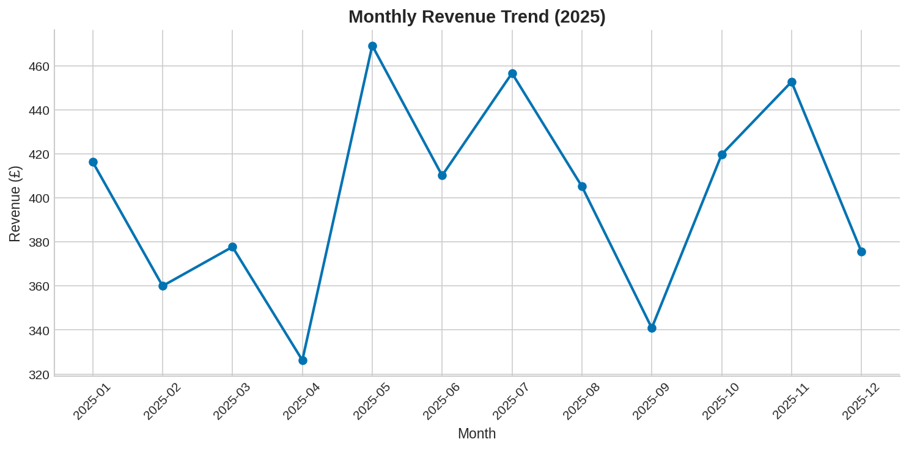

# Pharmacy Sales — Data Cleaning & Analysis

A small end-to-end data project in Python/Pandas: take a messy, real-world-style
pharmacy dispensing dataset, clean it step by step, and produce summary
statistics and charts.

I work as a Pharmacy Assistant in an NHS community pharmacy, so this project is
modelled on the kind of transactional data I see every day. The dataset is
**synthetic** (generated by `src/generate_data.py`) — no real patient or sales
data is used — but the data quality problems are the ones you genuinely find in
exported till/dispensing data.

## The problem

The raw dataset (`data/raw/pharmacy_sales_raw.csv`, 1,224 rows) contains:

| Issue | Example |
|---|---|
| Duplicate rows | ~2% of transactions repeated |
| Mixed date formats | `14/03/2025`, `2025-03-14`, `14-Mar-2025` |
| Inconsistent casing & whitespace | `PARACETAMOL 500MG`, `  ibuprofen 200mg ` |
| Prices stored as text | `£1.45` vs `1.45` |
| Missing values | blank categories, quantities, prices |
| Impossible values | negative quantities |

## The cleaning pipeline

`src/clean_data.py` fixes each issue with a logged, repeatable step:

1. Drop exact duplicates
2. Strip whitespace and standardise text casing
3. Parse mixed date formats into a single datetime column
4. Convert prices to numeric (strip currency symbols)
5. Impute missing categories from the product→category mapping, and missing
   prices from the product median; drop rows where quantity can't be inferred
6. Remove negative quantities
7. Add derived columns: `revenue`, `month`, `day_of_week`

Result: **1,224 raw rows → 1,164 analysis-ready rows**, saved to
`data/cleaned/pharmacy_sales_clean.csv`.

## The analysis

`src/analysis.py` produces headline statistics and three charts:



- **Monthly revenue trend** — seasonality across 2025
- **Revenue by category** — respiratory products (inhalers) lead despite lower volume
- **Payment mix by month** — NHS prescriptions vs private vs OTC sales

## How to run

```bash
pip install -r requirements.txt

python src/generate_data.py   # creates the messy raw dataset
python src/clean_data.py      # cleans it (logs every step)
python src/analysis.py        # stats + charts to outputs/
```

## Tools used

- Python 3
- Pandas (cleaning, aggregation)
- Matplotlib / Seaborn (visualisation)

## What I'd do next

- Load the cleaned data into SQLite and rewrite the aggregations in SQL
- Build a Power BI dashboard on top of the cleaned dataset
- Add pytest unit tests for each cleaning function
